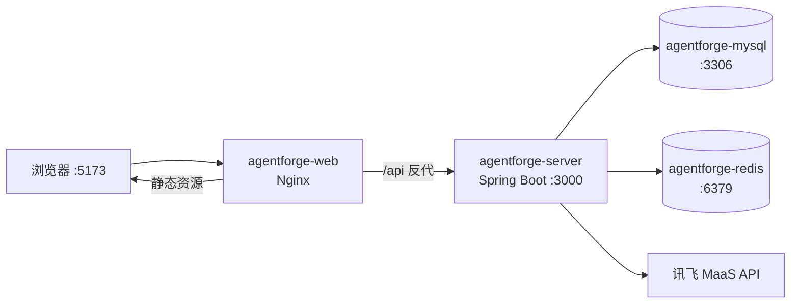
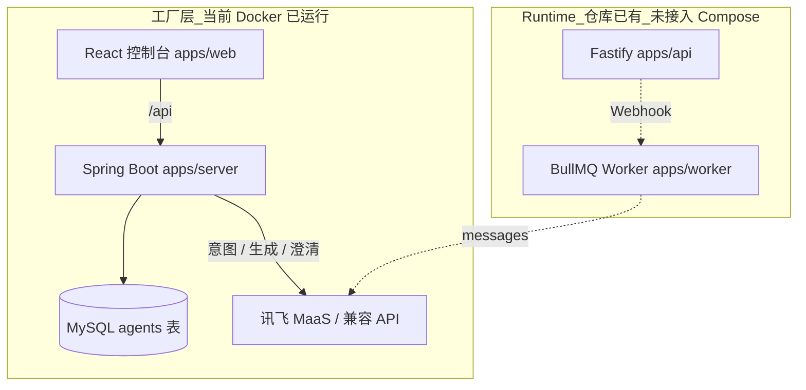
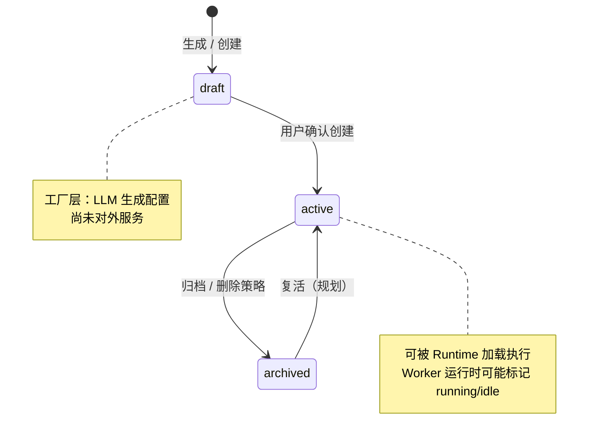
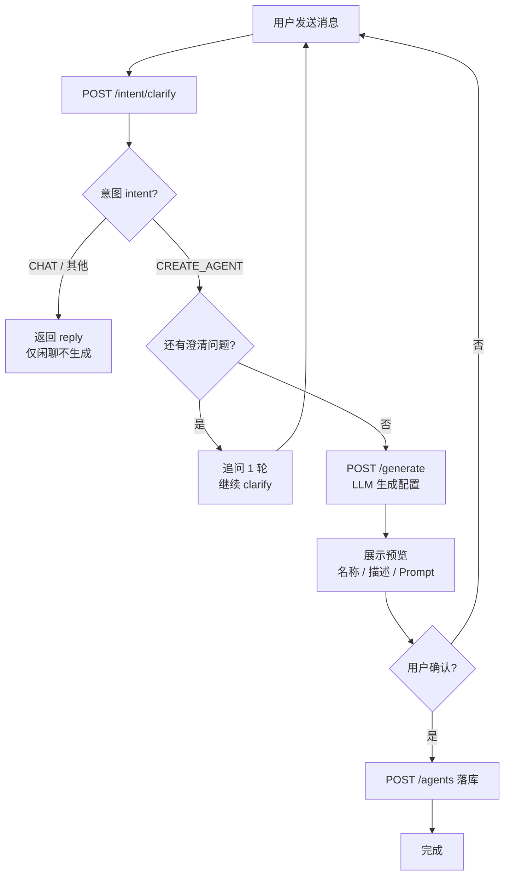
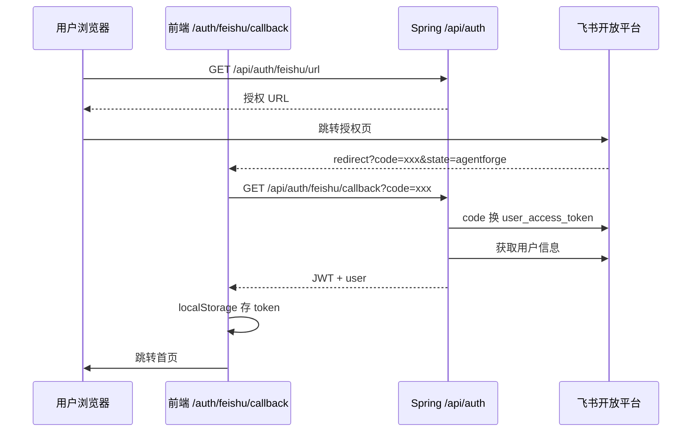
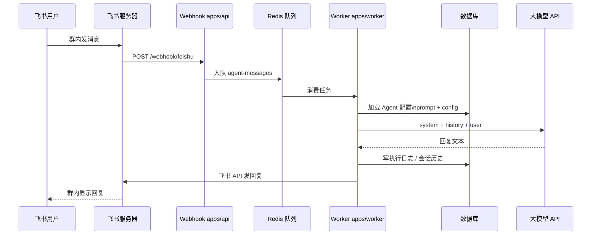
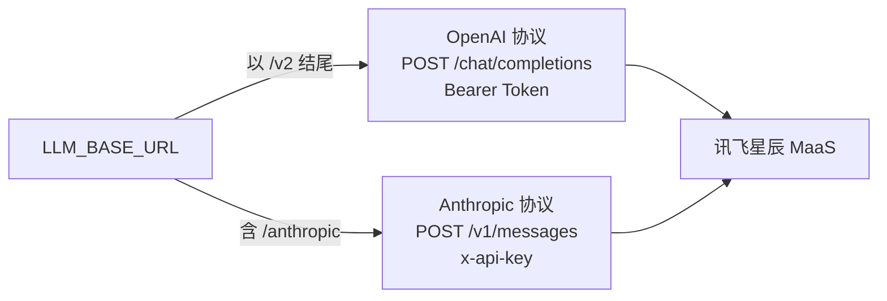

# AgentForge

对话驱动的企业 Agent 工厂平台。用户用自然语言描述目标，平台自动生成 Agent 配置；运行时按需加载配置并调用大模型执行任务。

> 更完整的产品与架构设计见 [`AgentForge-设计文档-v2.md`](./AgentForge-设计文档-v2.md)

**目录：** [架构图](#架构图) · [核心概念](#核心概念agent-基于什么实现) · [实现状态](#实现状态重要) · [快速开始](#快速开始docker推荐) · [API](#api-路由spring-boot-appsserver) · [对话创建流程](#对话创建-agent-流程)

---

## 架构图

### 整体分层（目标架构）

```
┌─────────────────────────────────────────────┐
│               管理控制台（Web）               │  用户入口
└─────────────────────────────────────────────┘
         │
┌────────┴──────────────────────────────────┐
│                 平台核心                    │
│  ┌───────────┐ ┌──────────┐ ┌──────────┐  │
│  │ 意图理解  │ │Agent生成 │ │生命周期  │  │
│  │   引擎    │ │  引擎    │ │  管理    │  │
│  └───────────┘ └──────────┘ └──────────┘  │
│  ┌───────────────────────────────────────┐ │
│  │         上下文处理引擎（规划中）        │ │
│  └───────────────────────────────────────┘ │
└─────────────────────────────────────────────┘
         │
┌────────┴──────────────────────────────────┐
│           渠道适配层（统一消息总线）         │
│     标准化收发 · 权限校验 · 消息队列        │
└─────────────────────────────────────────────┘
         │
┌────────┴──────────────────────────────────┐
│              执行层（飞书 / Web Widget）     │
└─────────────────────────────────────────────┘
         │
┌────────┴──────────────────────────────────┐
│    Agent Runtime（按需实例化，非常驻进程）   │
│   加载配置 · 调用 LLM · 执行工具 · 写日志  │
└─────────────────────────────────────────────┘
         │
┌────────┴──────────────────────────────────┐
│                 存储层                      │
│     Agent 定义库 · 知识/记忆 · 执行日志     │
└─────────────────────────────────────────────┘
```

### 当前 Docker 部署拓扑



### 工厂层 vs Runtime（代码现状）



### Agent 生命周期（MySQL `agents.status`）



### 对话创建 Agent 流程（当前已实现）



### 飞书 OAuth 登录控制台



重定向 URL 须与飞书后台一致，例如：`http://localhost:5173/auth/feishu/callback`

### Runtime 消息流（设计目标 · 飞书群）

> ⏳ 依赖 `apps/api` Webhook + `apps/worker`，尚未接入当前 Compose。



### LLM 调用协议选择（`LlmClient`）



| Base URL 示例 | 协议 | 请求路径 |
|---------------|------|----------|
| `https://maas-coding-api.cn-huabei-1.xf-yun.com/v2` | OpenAI | `/chat/completions` |
| `https://maas-coding-api.cn-huabei-1.xf-yun.com/anthropic` | Anthropic | `/v1/messages` |

---

## 核心概念：Agent 基于什么实现？

**结论：自研的「配置驱动 + LLM 按需调用」模型，不依赖 LangChain / AutoGPT / CrewAI 等 Agent 框架。**

| 概念 | 说明 |
|------|------|
| **Agent** | 不是常驻进程，而是数据库里的一条配置：`prompt`（系统提示词）+ `config`（JSON，含 tools 白名单等）+ `status`（draft / active / archived） |
| **工厂层** | 对话 → 意图识别 →（可选）需求澄清 → LLM 生成配置 → 写入 MySQL |
| **Runtime** | 消息触发时从 DB/缓存加载配置，组装 `system + history + user`，调用 LLM API，回写渠道并记日志（设计目标；见下文「实现状态」） |
| **LLM** | 通过 `LlmClient` 直连 HTTP，支持讯飞星辰 MaaS（OpenAI `/v2` 或 Anthropic `/anthropic` 协议） |

详见上文 [架构图](#架构图)。

### 与常见 Agent 框架的区别

| 维度 | LangChain 等 | AgentForge |
|------|----------------|------------|
| Agent 形态 | 代码中的 Chain / Graph | DB 中的 prompt + config |
| 编排 | 框架节点编排 | 单次或多轮 `messages` + system |
| 工具 | 框架 Tool 抽象 | `config` JSON 中的 tools 白名单（执行层待完善） |
| 部署 | 应用进程 | 按需 Worker + 渠道 Webhook（规划中） |

---

## 实现状态（重要）

| 能力 | 状态 | 说明 |
|------|------|------|
| 用户注册 / 登录 / JWT | ✅ | Spring `apps/server` |
| 飞书 OAuth 登录控制台 | ✅ | 需配置飞书开放平台重定向 URL |
| 对话创建 Agent（意图 + 澄清 + 生成） | ✅ | 仅 `CREATE_AGENT` 意图会进入生成；普通闲聊只回复 |
| Agent CRUD / 列表 / 状态 | ✅ | MySQL + MyBatis Plus |
| 网页试聊 / invoke API / 执行日志 | ✅ | `POST /agents/{id}/chat`、`/invoke`，`agent_execution_logs` |
| Agent 模板库 / 克隆 | ✅ | `/agents/templates`、`/agents/{id}/clone` |
| 飞书 Runtime（Webhook → 队列 → LLM → 回复） | ✅ | Spring `runtime` 包，`AgentQueueProcessor` |
| 飞书群部署绑定 | ✅ | `POST /agents/{id}/deploy/feishu`，详情页绑定 `chat_id` |
| 对话历史持久化（创建流程） | ✅ | `conversations` 相关 API |
| 按 ttlDays 自动归档 | ✅ | 每日定时任务 + `config.lifecycle` |
| 上下文变知识 / RAG | 📋 | 设计文档中有，代码未完整实现 |
| 遗留 Node Worker / Fastify | 🗄️ | `apps/worker`、`apps/api` 已由 Spring Runtime 替代 |

**当前 Docker 栈 = 工厂 + Spring Runtime（飞书渠道已接入）。**

---

## 技术栈

| 层级 | 技术 | 目录 |
|------|------|------|
| 管理控制台 | React 19、Vite、Tailwind CSS v4、React Router | `apps/web` |
| **主后端（推荐）** | Java 21、Spring Boot 3.4、MyBatis Plus、Flyway、JWT | `apps/server` |
| 遗留后端（Runtime 原型） | Node.js、Fastify、Prisma | `apps/api` |
| Agent Runtime Worker（原型） | Node.js、BullMQ、Anthropic SDK | `apps/worker` |
| 数据库（当前） | MySQL 8 | Flyway 迁移在 `apps/server/.../mysql/` |
| 缓存 / 队列 | Redis 7 | Compose 已启；Worker 消费待接 |
| LLM | 讯飞星辰 MaaS Coding Plan（OpenAI 或 Anthropic 兼容端点） | `LlmClient` |

---

## 项目结构

```
AgentForge/
├── apps/
│   ├── server/          # 主后端：工厂层（意图、生成、Agent、用户、对话）
│   ├── web/             # 管理控制台（Nginx 静态 + /api 反代）
│   ├── api/             # [遗留] Fastify API + 飞书 Webhook + Prisma
│   └── worker/          # [遗留] BullMQ Worker，按需执行 Agent
├── packages/
│   └── shared/          # 共享 TypeScript 类型
├── docker/
│   ├── docker-compose.yml
│   ├── run.sh / stop.sh
├── AgentForge-设计文档-v2.md
└── .env.example
```

---

## 快速开始（Docker，推荐）

### 1. 配置环境变量

```bash
cp .env.example .env
# 编辑 .env，至少填写：
#   LLM_API_KEY
#   FEISHU_APP_ID / FEISHU_APP_SECRET（若使用飞书登录）
```

### 2. 构建并启动

```bash
# 构建前端静态资源
cd apps/web && pnpm install && pnpm run build && cd ../..

# 构建后端 JAR
cd apps/server && mvn package -DskipTests && cd ../..

# 启动全部服务（读取项目根目录 .env）
cd docker
docker compose --env-file ../.env up -d --build
```

### 3. 访问

| 服务 | 地址 |
|------|------|
| 管理控制台 | http://localhost:5173 |
| 后端 API（经 Nginx 反代） | http://localhost:5173/api/... |
| 后端直连（调试用） | http://localhost:3000 |
| 健康检查 | http://localhost:5173/api/health |

默认管理员（Flyway 种子数据）：用户名 `admin`，密码 `password`（**生产环境务必修改**）。

### 4. 仅更新配置后重启后端

```bash
cd docker
docker compose --env-file ../.env up -d --force-recreate server
```

---

## 环境变量

根目录 `.env` 由 `docker compose --env-file ../.env` 注入 `server` 容器。

| 变量 | 说明 |
|------|------|
| `LLM_BASE_URL` | 讯飞 MaaS 基址。`/v2` → OpenAI 协议；`/anthropic` → Anthropic 协议（`LlmClient` 自动识别） |
| `LLM_API_KEY` | Coding Plan API Key |
| `LLM_MODEL` | 默认 `astron-code-latest` |
| `FEISHU_APP_ID` / `FEISHU_APP_SECRET` | 飞书开放平台自建应用 |
| `FEISHU_REDIRECT_URI` | 默认 `http://localhost:5173/auth/feishu/callback`，须与飞书后台「安全设置 → 重定向 URL」完全一致 |
| `JWT_SECRET` | JWT 签名密钥（Compose 内可覆盖，生产必改） |

参考：[讯飞星辰 MaaS · Coding Plan 文档](https://www.xfyun.cn/doc/spark/CodingPlan.html)

### 飞书登录配置要点

流程图见 [飞书 OAuth 登录控制台](#飞书-oauth-登录控制台)。

1. [飞书开放平台](https://open.feishu.cn/app) 创建企业自建应用  
2. **安全设置 → 重定向 URL** 添加：`http://localhost:5173/auth/feishu/callback`  
3. 开通网页登录 / 用户信息相关权限并发布应用  
4. 若报错 **20029**：表示 `redirect_uri` 未在对应 `app_id` 下登记，见[官方说明](https://open.feishu.cn/document/faq/trouble-shooting/how-to-resolve-the-authorization-page-20029-error)

---

## API 路由（Spring Boot，`apps/server`）

前缀均为 `/api`，需登录接口携带 `Authorization: Bearer <token>`。

| 方法 | 路径 | 描述 |
|------|------|------|
| POST | `/auth/login` | 用户名密码登录 |
| POST | `/auth/register` | 注册 |
| GET | `/auth/me` | 当前用户 |
| GET | `/auth/feishu/url` | 获取飞书授权链接 |
| GET | `/auth/feishu/callback?code=` | 飞书回调换 JWT（前端回调页调用） |
| POST | `/intent/clarify` | 意图识别 + 澄清 / 闲聊回复 |
| POST | `/generate` | LLM 生成 Agent 配置（body: `{ "prompt": "..." }`） |
| GET/POST/PUT/DELETE | `/agents` | Agent CRUD |
| POST | `/conversations` | 创建对话 |
| POST | `/conversations/:id/messages` | 写入消息 |
| GET | `/health` | 健康检查（也可 `/api/health` 经反代） |

> 旧 README 中的 `/api/generator/generate`、`/webhook/feishu` 属于 `apps/api`（Fastify），与当前 Docker 主栈不一致。

---

## 本地开发（可选）

### 仅前端热更新

```bash
pnpm install
cd apps/web && pnpm dev   # http://localhost:5173，Vite 代理 /api → :3000
```

需另起 Spring 后端（或 Docker 中的 `server`）。**请用 5173 访问**，避免本机 3000 端口旧进程干扰。

### Spring 后端

```bash
cd apps/server
mvn spring-boot:run
# 默认连 localhost MySQL/Redis，与 application.yml 一致
```

### 遗留 Node 栈（Runtime 原型）

```bash
pnpm install
cd apps/api && pnpm prisma migrate dev
pnpm dev   # 根 package.json 会并行启动 apps/*（含 api、worker）
```

需 PostgreSQL（Prisma）及 Redis，与当前 Docker Compose **不是同一套库**。

---

## 对话创建 Agent 流程

流程图见 [对话创建 Agent 流程（当前已实现）](#对话创建-agent-流程当前已实现)。

1. 用户进入「创建 Agent」页，可先闲聊  
2. `POST /intent/clarify`：LLM 判断意图  
   - **非 `CREATE_AGENT`**（如打招呼）：返回 `reply`，不生成  
   - **`CREATE_AGENT`**：进入需求澄清（可能追问 1～2 轮）  
3. 信息足够后 `POST /generate`，得到 name / description / prompt / config  
4. 用户确认后 `POST /agents` 落库  

---

## 构建镜像说明

| 服务 | 构建前提 |
|------|----------|
| `web` | `apps/web/dist` 需先 `pnpm run build`（镜像内 COPY dist） |
| `server` | `apps/server/target/*.jar` 需先 `mvn package`（镜像内 COPY jar） |

---

## 路线图（与代码对齐）

- [ ] 将 Runtime（Webhook + Worker）接入 Docker 或迁移至 Spring  
- [ ] 实现 `deploy` 与飞书渠道绑定  
- [ ] 工具调用与 `config.tools` 执行  
- [ ] 上下文知识提炼与 RAG  
- [ ] 统一 README / 移除或归档 `apps/api` 双栈歧义  

---

## 许可证

私有 / 内部项目（按仓库实际许可证补充）。
